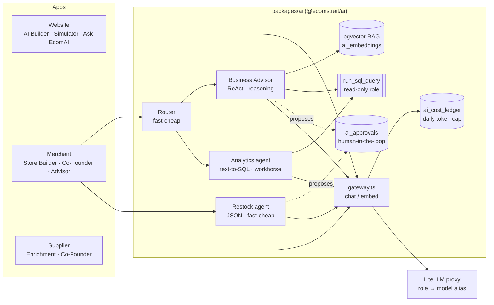

# EcomStrait — The AI Ecommerce Co-Founder

> **Describe a business idea. EcomAI finds the products, builds the store, writes the SEO, launches it, and then keeps running it with you.**

EcomStrait is an AI-native commerce operating system built around **EcomAI**, an agentic
co-founder that takes a first-time entrepreneur from *"I want to sell pet accessories"* to a
live, stocked, SEO-ready store — on Shopify or on EcomStrait's own hosted storefront — and
then stays on as an always-available partner for pricing, restocking, analytics and content.

On the other side of the marketplace, verified **suppliers** list real inventory that EcomAI
draws from, so every generated store is backed by products that can actually ship.

<p align="center">
  
</p>

---

## Table of contents

- [The problem](#the-problem)
- [What EcomAI does](#what-ecomai-does)
- [Demo flow (5 minutes)](#demo-flow-5-minutes)
- [AI architecture](#ai-architecture)
- [Guardrails and honesty](#guardrails-and-honesty)
- [Platform overview](#platform-overview)
- [Tech stack](#tech-stack)
- [Repository layout](#repository-layout)
- [Quick start](#quick-start)
- [Environment variables](#environment-variables)
- [Database](#database)
- [Docs](#docs)
- [Status and roadmap](#status-and-roadmap)

---

## The problem

Starting an online store today means stitching together a dozen tools and skills you do not
have yet: finding a trustworthy supplier, negotiating MOQs, picking a platform, choosing a
theme, writing copy, setting up SEO, wiring payments, and then figuring out what to reorder
and what to charge. Most first-time founders stall somewhere in that chain, and the ones who
get through it spend weeks doing work that adds nothing to the business itself.

Existing tools each solve one slice — a storefront builder, a dropshipping catalog, a
wholesale marketplace, an SEO plugin. None of them act like a partner who already knows how
to do all of it.

## What EcomAI does

EcomAI is not a chatbot bolted onto a store builder. It is a small team of specialised agents
behind two chat surfaces the merchant actually talks to:

| Surface | What it does |
|---|---|
| **Store Builder** | Conversational discovery (2–4 turns, no fixed script) → one-shot store plan (name, tagline, palette, hero copy, collections, SEO title/description) → auto-selected products from real supplier inventory → theme choice → live preview → launch. |
| **Co-Founder** | Post-launch partner with tools to *do* things, not just answer: suggest products, build or launch another store, edit live store content, write blog posts, and hand hard questions to the Business Advisor. |

Working behind those two chats:

| Specialist | Role |
|---|---|
| **Product Suggestion agent** | Deterministic, SQL-ranked recommendations from platform-wide sales × margin. The LLM only narrates; it never invents the ranking. |
| **SEO Advisor** | Audits and rewrites titles, descriptions and category copy; permanently caches AI-written category pages per store. |
| **Business Advisor** | LangGraph ReAct agent with RAG over the niche knowledge base, a read-only SQL tool over the merchant's own data, and Shopify tools. |
| **Analytics agent** | Text-to-SQL over tenant-scoped tables, answers "what sold best last week" with real numbers. |
| **Restock agent** | Fires from the Shopify order webhook after every sale and *proposes* a restock; a human approves. |
| **Supplier Co-Founder** | The supplier-side counterpart: grounded in revenue, catalog and low-stock data; enriches product listings with descriptions, SEO and suggested retail price. |

And on the public site, three pre-signup AI moments turn marketing into a demo:
**AI Builder** (idea → simulated business plan and live store preview), **AI Business
Simulator** (persona → estimated revenue/profit ranges), and **Ask EcomAI** (a grounded
conversational FAQ).

## Demo flow (5 minutes)

1. **Website** (`localhost:3000`) — type an idea into the hero AI Builder and watch the
   labeled, simulated build plan and store preview appear.
2. **Merchant portal** (`localhost:3002`) — sign up, open **Builder**, and describe the
   store in plain language. Answer two or three questions, or say *"you pick"* and get ranked
   product suggestions instead of a guess.
3. **Launch** — choose the EcomStrait-hosted storefront (instant, optional custom domain with
   automatic SSL) or a Shopify store provisioned from a managed dev-store pool with a Liquid
   theme and products pushed automatically.
4. **Co-Founder** — ask *"what should I restock?"*, *"write a blog post about our new
   collection"*, or *"add a Shipping page"*. Watch the tool calls, then see the change live.
5. **Approvals** — any agent-proposed write (a price change, a restock) lands in a pending
   approval queue. Nothing touches the store until a human clicks approve.
6. **Supplier portal** (`localhost:3001`) — see the other side: catalog, incoming listing
   requests, AI product enrichment, and the supplier Co-Founder.

Every AI feature has a deterministic fallback, so the whole flow runs **with zero API keys**
on the preset engines. Point it at a model gateway and the same code becomes fully agentic.

## AI architecture

The AI layer is a single shared package, `packages/ai` (`@ecomstrait/ai`), consumed by all
three Next.js apps. Its design rules, from `Docs/AI-Native-Migration-Plan.md`:

- **No app code ever names a vendor or a model.** Callers ask for a *role* —
  `reasoning`, `workhorse`, `fast-cheap`, `embeddings` — which resolves to an alias on a
  self-hosted [LiteLLM](https://github.com/BerriAI/litellm) gateway. The reference config maps
  those roles to Claude Opus / Sonnet / Haiku and Voyage embeddings; swapping to Groq-hosted
  open models or local Ollama is a one-line change on the proxy, never in the repo.
- **One HTTP call site.** `packages/ai/src/gateway.ts` is the only file that talks to a model.
  Everything else is LangChain / LangGraph on top of an OpenAI-compatible client pointed at it.
- **Roles fail loudly.** A missing role env var throws instead of silently degrading to the
  wrong model. Feature-level code then falls back to its deterministic preset.



**What is in the package**

| Module | Purpose |
|---|---|
| `gateway.ts`, `roles.ts` | `chat()` / `embed()` over the gateway; role → alias resolution; JSON-mode structured output; reasoning-content round-tripping so chain-of-thought replays on later turns. |
| `agents/orchestrator.ts` | LangGraph `StateGraph`: a one-word router node dispatches to Business Advisor or Analytics agent, persists a full trace (input, output, tool calls) to `ai_agent_runs`, retries once on empty synthesis. |
| `agents/business-advisor.ts` | `createReactAgent` on the `reasoning` role with `search_knowledge_base`, `run_sql_query`, and caller-injected tools (the merchant app injects Shopify read/write tools). |
| `agents/analytics-agent.ts` | Single-tool text-to-SQL agent; the tool description embeds the tenant-scoped schema. |
| `agents/restock-agent.ts` | Tool-free, JSON-mode, 8-second decision; fails closed. |
| `rag/` | Embeddings via the gateway, upsert into `ai_embeddings` (tenant-scoped plus a global tenant for shared content), cosine retrieval through the `match_ai_embeddings` RPC. |
| `mcp/` | An MCP server exposing the same guarded read-only `query` tool, so external agent hosts can use the merchant's data too. The merchant app also serves a Shopify MCP server. |
| `guardrails/` | Human-in-the-loop approvals, per-tenant token ledger with `assertCostBudget` checked *before* every call, TTL snapshot cache for expensive aggregations. |
| `memory/` | Persistent chat threads: last 30 messages plus a rolling summary regenerated by the `fast-cheap` role. |

The merchant app layers its own orchestration on top: `cofounder-orchestrator.ts` builds
the Co-Founder as a ReAct agent whose tools are the same session-authenticated functions the
UI buttons call — `list_my_stores`, `suggest_products`, `build_store`, `launch_store`,
`edit_store_content`, `write_blog_post`, `ask_business_advisor`.

Every system prompt in the codebase is documented one-file-per-prompt in `Docs/prompts/`,
with its role, temperature, token limit, timeout and fallback. The rule is that the doc is
updated in the same commit as the prompt.

## Guardrails and honesty

We treated "what can go wrong when an agent runs a store" as a first-class design problem.

- **Agents propose, humans approve.** Write tools (`propose_set_product_price`,
  `propose_set_product_status`, restock) only create a pending row in `ai_approvals`. The
  single place a Shopify write executes is the approval endpoint, guarded for idempotency
  against double-clicks.
- **SQL is read-only twice over.** A `SELECT`/`WITH` regex guard *and* a dedicated Postgres
  role with SELECT-only privileges, with hard row caps. The regex is defense in depth, not
  the boundary.
- **Cost is metered per tenant, per role, per model.** A daily token cap (default 200k) is
  checked before any model call; per-plan budgets show the merchant "N AI tokens left today".
- **Numbers are never invented.** Rankings and analytics come from SQL; the model narrates.
  Public-site AI outputs are explicitly labeled as simulated previews with example ranges.
- **Synthetic data is marked.** Customer and traffic tables carry an `is_synthetic` flag
  so the Co-Founder has something to reason over before real traffic exists, without ever
  passing it off as real.
- **Audited.** `Docs/AI Hallucination and Reasoning Gaps Audit (2026-09-04).md` is a
  46-finding static review of every prompt; recent commits close the gaps it found.
- **Money fails closed.** Wallet debits treat a database error as insufficient funds; every
  balance change goes through one atomic Postgres function with idempotency keys for Stripe
  top-ups.

## Platform overview

| App | Port | What it is |
|---|---|---|
| `apps/website` | 3000 | Public marketing site with the three pre-signup AI demos, theme gallery, lead/waitlist capture with a 30-day Resend drip, first-party funnel analytics. |
| `apps/merchant` | 3002 | The core product. Store Builder, Co-Founder, stores, orders, inventory, sales, wallet, billing, custom domains. **Also the storefront runtime** — hosted stores and connected custom domains are served from this deployment. Owns all Shopify credentials and the dev-store pool. |
| `apps/supplier` | 3001 | Supplier onboarding and verification, catalog (manual / CSV), inventory, listing requests, orders, quality score, analytics, wallet, supplier Co-Founder. Also hosts the platform **admin panel**. |
| `apps/ecom-strait-ai` | — | Embedded Shopify admin app (React Router 7 + Polaris + Prisma). Lets a merchant browse and import supplier products from inside Shopify; all AI and credentials stay behind an HTTP bridge to the merchant app. |

Shared packages: `@ecomstrait/ai` (above), `@ecomstrait/auth` (Supabase SSR auth, session
guards, role checks), `@ecomstrait/db` (typed schema, service-role client, plans, the wallet
and settlement ledger), `@ecomstrait/ui` (design tokens and primitives), `@ecomstrait/config`.

**Money flow.** Merchants and suppliers each hold a wallet. Orders split into prepaid and
cash-on-delivery paths, land in a payable ledger, and settle weekly via a cron job with a
0.05% platform fee. Plans are Free / Basic / Premium / Full with per-plan daily AI token
budgets and store or catalog limits.

## Tech stack

- **Framework:** Next.js 16 (App Router, Turbopack), React 19, TypeScript, Tailwind CSS v4
- **AI:** LangChain + LangGraph, Model Context Protocol SDK, LiteLLM gateway (Claude family
  in the reference config; Groq and Ollama documented as alternatives), Voyage embeddings,
  pgvector
- **Data & auth:** Supabase (Postgres 17, Auth, Storage, RLS), 50 SQL migrations
- **Payments & ops:** Stripe (subscriptions, storefront checkout, wallet top-ups), Resend,
  Vercel Domains API (custom domains + auto SSL), Cloudflare R2, Inngest (reserved)
- **Commerce:** Shopify Admin GraphQL API 2026-10, six bundled Liquid themes, twenty static
  HTML niche templates served from a private bucket
- **Monorepo:** pnpm workspaces + Turborepo

## Repository layout

```
apps/
  website/           # marketing site + pre-signup AI demos (:3000)
  merchant/          # merchant portal + storefront runtime + Shopify integration (:3002)
  supplier/          # supplier portal + admin panel (:3001)
  ecom-strait-ai/    # embedded Shopify app (npm + Shopify CLI, outside the pnpm workspace)
packages/
  ai/                # @ecomstrait/ai — gateway, roles, agents, RAG, MCP, guardrails, memory
  auth/              # @ecomstrait/auth — Supabase SSR auth helpers and route guards
  db/                # @ecomstrait/db — Database types, admin client, plans, wallet ledger
  ui/                # @ecomstrait/ui — Tailwind v4 design tokens and shared primitives
  config/            # shared tsconfig
supabase/migrations/ # full schema, chronological
themes/              # 20 static store templates (gitignored, synced to a private bucket)
Docs/                # product specs, implementation plans, prompt docs, audits
```

## Quick start

Prerequisites: Node 22, pnpm 10, a Supabase project (or the Supabase CLI for local).

```bash
pnpm install

# copy env templates for the apps you want to run
cp apps/website/.env.example  apps/website/.env.local
cp apps/merchant/.env.example apps/merchant/.env.local
cp apps/supplier/.env.example apps/supplier/.env.local

# apply the schema to your Supabase project
supabase db push          # or run supabase/migrations/*.sql in order

# run everything, or one app at a time
pnpm dev                  # website :3000, supplier :3001, merchant :3002
pnpm dev:merchant
```

With only the Supabase variables set, every AI surface runs on its deterministic preset
engine and forms store safely. To make it agentic, deploy a LiteLLM proxy following
`Docs/AI-Native-Manual-Setup.md` and set the gateway variables below.

The embedded Shopify app is developed with the Shopify CLI on its own:

```bash
cd apps/ecom-strait-ai
npm install
npm run dev               # shopify app dev
```

Other useful scripts: `pnpm build` (type-checks and prerenders every app),
`pnpm lint`, `pnpm themes:upload` (sync the static templates to the private bucket).

## Environment variables

Each app ships a commented `.env.example`. The groups that matter:

| Group | Variables | Used by |
|---|---|---|
| Supabase | `NEXT_PUBLIC_SUPABASE_URL`, `NEXT_PUBLIC_SUPABASE_ANON_KEY`, `SUPABASE_SERVICE_ROLE_KEY` | all |
| AI gateway | `AI_GATEWAY_URL`, `AI_GATEWAY_API_KEY`, `AI_MODEL_REASONING`, `AI_MODEL_WORKHORSE`, `AI_MODEL_FAST_CHEAP`, `AI_MODEL_EMBEDDINGS`, `AI_DAILY_TOKEN_CAP` | all |
| Agents | `MCP_SUPABASE_READONLY_URL` (SELECT-only Postgres role), `AI_ADVISOR_ENABLED` (route editor questions through the LangGraph orchestrator) | merchant |
| Stripe | `STRIPE_SECRET_KEY`, `STRIPE_WEBHOOK_SECRET`, `STRIPE_PRICE_BASIC/PREMIUM/FULL` | merchant, supplier |
| Shopify | `SHOPIFY_API_KEY`, `SHOPIFY_API_SECRET`, `SCOPES`, `SHOPIFY_APP_URL`, `SHOPIFY_APP_SHARED_SECRET` / `ECOMSTRAIT_SHARED_SECRET` | merchant, Shopify app |
| Email | `RESEND_API_KEY`, `RESEND_FROM`, `LEAD_NOTIFY_EMAIL`, `OPS_ALERT_EMAIL` | all |
| Domains | `VERCEL_TOKEN`, `VERCEL_PROJECT_ID`, `STOREFRONT_A_RECORD`, `STOREFRONT_CNAME` | merchant |
| Cross-app links | `NEXT_PUBLIC_MERCHANT_APP_URL`, `NEXT_PUBLIC_SUPPLIER_APP_URL`, `NEXT_PUBLIC_WEBSITE_URL`, `ECOMSTRAIT_MERCHANT_URL` | website, supplier |

Model role variables hold gateway *aliases*, never vendor model ids.

## Database

Supabase Postgres, 50 migrations in `supabase/migrations/`, all RLS-enforced. The main
groups:

- **Identity:** `profiles` with roles (admin, supplier, supplier_staff, business_owner, customer), `supplier_members`
- **Supply side:** `suppliers`, verification and documents, `products` (with MAP price guard), `inventory_adjustments`, supplier subscriptions and usage
- **Merchant side:** `stores` (plan JSON, draft TTL, domain), `store_theme_versions` (undo), `store_assets`, `selected_products`, `shopify_stores` (dev-store pool and transfer), subscriptions and usage
- **Storefront:** `store_products` (supplier-approved listings), `store_orders`, `store_pages`, `store_posts`, `store_category_content`, `customers`, `store_traffic_events`, `rate_limits`
- **Fulfilment:** `product_requests` → `request_items` / `request_messages` → `orders` / `order_items`
- **Money:** merchant and supplier wallets, `wallet_transactions`, `payable_ledger`, `settlement_batches`, `payout_requests`, the atomic `wallet_adjust()` function
- **AI:** `ai_embeddings` (+ `match_ai_embeddings`), `ai_agent_runs`, `ai_approvals`, `ai_cost_ledger`, `ai_snapshot_cache`, `ai_chat_threads`

Marketing tables (`leads`, `newsletter_subscribers`, `waitlist_subscribers`,
`analytics_events`) are insert-only from the browser.

## Docs

- `Docs/AI-Native-Migration-Plan.md` — the model-agnostic architecture and its seven phases
- `Docs/AI-Native-Manual-Setup.md` — deploying the gateway, MCP servers and read-only DB role
- `Docs/ECOMAI Team members and their Abilities.md` — plain-language tour of every agent
- `Docs/prompts/` — one file per system prompt, kept in sync with the code
- `Docs/AI Hallucination and Reasoning Gaps Audit (2026-09-04).md` — prompt audit
- `Docs/Credits-Settlement-Plan.md`, `Docs/Theme-Platform-Plan.md`,
  `Docs/Entrepreneur-Portal-Plan.md`, `Docs/Supplier-Portal-Plan.md` — subsystem plans
- `Docs/# 01. Executive Summary.md` … `# 19. Roadmap, Release Strategy & Product Vision.md` — the original numbered product specification set
- `Docs/ai-architecture.dot` — source for the diagram at the top

## Status and roadmap

**Working today:** end-to-end idea → launched store on both hosting paths, Co-Founder with
tool use and persistent memory, RAG-grounded Business Advisor, text-to-SQL analytics,
human-approved restock and price changes, supplier marketplace with listing approvals,
wallets and weekly settlement, custom domains with automatic SSL, embedded Shopify app.

**Known limits:** model calls are non-streaming; the RAG corpus is the niche knowledge base
and grows with usage; customer and traffic analytics run on flagged synthetic data until
real order webhooks accumulate; Shopify order webhooks await Protected Customer Data
approval on the public app listing.

**Next:** streaming agent responses, forecasting on real traffic, multi-store portfolio
advice, and the Phase 3+ roadmap in the numbered spec `# 19. Roadmap, Release Strategy &
Product Vision.md` (conversational analytics, white-label, enterprise governance).

---

Built with Next.js, Supabase, LangGraph and a lot of prompts. EcomAI is a co-founder, not an
assistant: it takes the work, shows the reasoning, and asks before it spends your money.
